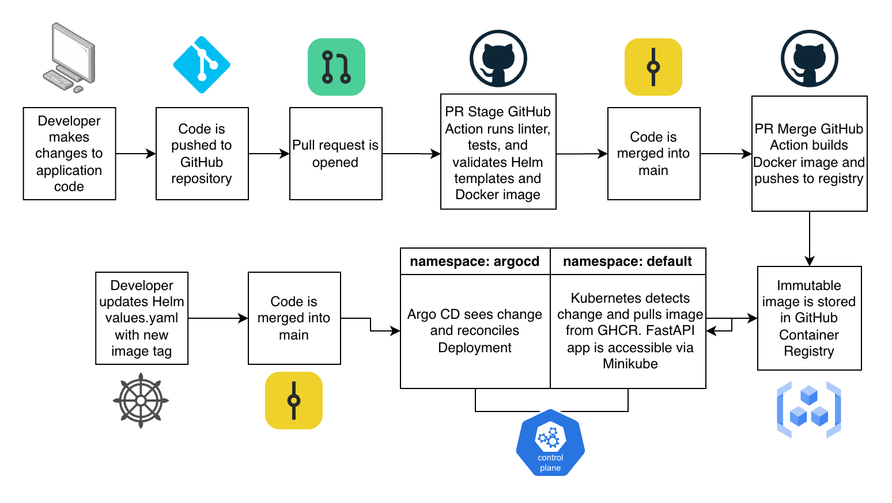

# Kubernetes GitOps Pipeline

A small platform engineering project that deploys a FastAPI application to Kubernetes using Helm and Argo CD. The project uses GitHub Actions for CI and container publishing, with Git as the source of truth for the Kubernetes deployment.

## Why I Built This

My platform engineering work has included Kubernetes, Helm, GitHub Actions, containerized applications, and production deployment workflows. I built this project to bring those pieces together in a small environment where I could work through the full delivery lifecycle myself.

The main goal was to gain hands-on experience with **GitOps and Argo CD**: defining the application state in Git, allowing Argo CD to reconcile that state into Kubernetes, and separating CI responsibilities from deployment.

The project currently includes:

- A Python FastAPI service with health, version, and Prometheus metrics endpoints
- A multi-stage Docker build using `uv`
- A Helm chart with resource limits and Kubernetes readiness/liveness probes
- GitHub Actions for application testing, linting, Helm and Docker validation, container builds, and publishing to GHCR
- A local Kubernetes cluster running in Minikube
- Argo CD using an app-of-apps pattern to manage the application deployment

## Architecture



`Application code → GitHub Actions → Container image → Helm → Argo CD → Kubernetes`

GitHub Actions handles CI and image publishing. Kubernetes configuration is stored in Git and rendered through Helm. Argo CD watches the repository and reconciles the declared state with the Minikube cluster.

## Prerequisites

To run the project locally, install:

- [Git](https://git-scm.com/)
- [Docker](https://docs.docker.com/get-docker/)
- [Minikube](https://minikube.sigs.k8s.io/docs/start/)
- [kubectl](https://kubernetes.io/docs/tasks/tools/)
- [Helm](https://helm.sh/docs/intro/install/)
- [uv](https://docs.astral.sh/uv/getting-started/installation/)

Argo CD itself will be installed into the Kubernetes cluster during deployment. The Argo CD CLI is optional and is not required to run the project.

## Deploy Locally

### 1. Clone the repository

```bash
git clone https://github.com/meghanleia/kubernetes-gitops-pipeline.git
cd kubernetes-gitops-pipeline
```

### 2. Start Minikube

```bash
minikube start
```

Confirm that the cluster is available:

```bash
kubectl get nodes
```

### 3. Install Argo CD

Create the Argo CD namespace:

```bash
kubectl create namespace argocd
```

Install Argo CD:

```bash
kubectl apply -n argocd \
  -f https://raw.githubusercontent.com/argoproj/argo-cd/stable/manifests/install.yaml
```

Wait for the Argo CD workloads to become ready:

```bash
kubectl wait \
  --for=condition=Available \
  deployment/argocd-server \
  -n argocd \
  --timeout=180s
```

### 4. Bootstrap the GitOps deployment

Apply the root Argo CD application:

```bash
kubectl apply -f argocd/root-app.yaml
```

The root application watches the `argocd/` directory and creates the FastAPI Argo CD application. That application then renders the Helm chart in `helm-charts/fastapi-app` and deploys it to the cluster.

Check the Argo CD applications:

```bash
kubectl get applications -n argocd
```

Check the application workload:

```bash
kubectl get pods
kubectl get services
```

Once reconciliation completes, the `fastapi-app` Pod should be running and ready.

### 5. Access the FastAPI application

Expose the application through Minikube:

```bash
minikube service fastapi-app --url
```

Minikube will print a local URL similar to:

```text
http://127.0.0.1:57123
```

> **Note:** Depending on your operating system and Minikube driver, `minikube service fastapi-app --url` may keep this terminal process running while it maintains a network tunnel. This is expected on macOS with the Docker driver. If the command remains active, leave the terminal open and use a second terminal for the commands below.

Set the returned URL as an environment variable:

```bash
export APP_URL="http://127.0.0.1:57123"
```

Replace the example URL with the URL returned by Minikube.

Test the application:

```bash
curl "$APP_URL/"
```

Health check:

```bash
curl "$APP_URL/health"
```

Application version:

```bash
curl "$APP_URL/api/version"
```

Prometheus-format application metrics:

```bash
curl "$APP_URL/api/metrics"
```

The same endpoints can also be opened directly in a browser.

When finished, return to the terminal running the Minikube service tunnel and press `Ctrl-C` to close it.

## GitOps Workflow

The Argo CD applications use automated sync with pruning and self-healing enabled.

Changes to the Helm chart or its values are committed to Git rather than applied directly to the cluster. Argo CD detects the difference between Git and the live Kubernetes state and reconciles the cluster automatically.

The repository also includes two GitHub Actions workflows:

- **PR Stage Validate** — installs dependencies, runs pytest and flake8, validates the Docker build, and renders the Helm chart.
- **Main Build and Deploy** — builds the application image after application changes are merged to `main` and publishes a SHA-tagged image to GitHub Container Registry.

## Local Development

Install dependencies:

```bash
uv sync --project app
```

Run the FastAPI application:

```bash
uv run --project app fastapi dev app/src/main.py
```

Run tests:

```bash
uv run --project app pytest app/tests
```

Render the Helm manifests locally:

```bash
helm template fastapi-app ./helm-charts/fastapi-app \
  --values ./helm-charts/fastapi-app/values.yaml
```

## Destroy the Environment

Delete the Argo CD-managed applications:

```bash
kubectl delete -f argocd/root-app.yaml
```

Then remove the local Kubernetes cluster:

```bash
minikube delete
```

This removes the application, Argo CD installation, Kubernetes resources, and locally built container image with the Minikube cluster.
